# Trivia MORE 🎓🧠

[](LICENSE)
[]()
[]()
[]()

**Prepare. Practice. Succeed.**

Trivia MORE is a comprehensive quiz application designed to enhance learning and prepare students for university exams through structured practice and assessment.

## 🌐 Live Demo

Visit the application at [trivia-more.it](https://www.trivia-more.it/)

## 📖 About

Trivia MORE transforms the way students prepare for university exams by providing an interactive, structured learning environment. Built with modern web technologies, it offers a comprehensive quiz platform that adapts to different learning styles and academic needs.

The application serves as a bridge between traditional study methods and digital learning, offering features like real-time progress tracking, adaptive questioning, and collaborative learning tools. Whether you're a student looking to test your knowledge, an educator wanting to create engaging content, or an administrator managing academic programs, Trivia MORE provides the tools you need to succeed.

## 📋 Table of Contents

- [🏗️ Architecture Overview](#️-architecture-overview)
- [🚀 Getting Started](#-getting-started)
- [🐳 Docker Commands](#-docker-commands)
- [🗄️ Database Management](#️-database-management)
- [📚 Documentation](#-documentation)
- [🤝 Contributing](#-contributing)
- [🐛 Issue Reporting](#-issue-reporting)
- [📄 License](#-license)

## 🏗️ Architecture Overview

Trivia MORE is built with a modern, scalable architecture designed for performance and maintainability:

```mermaid
graph TD
    A[🖥️ Frontend - Next.js 15] --> B[🔌 API Routes]
    B --> C[🔐 NextAuth.js v5]
    B --> D[🗃️ Prisma ORM]
    D --> E[🐘 PostgreSQL]

    F[🚀 Vercel Edge] --> A
    G[🌐 Neon Database] --> E

    H[📱 Client Components] --> A
    I[⚡ Server Components] --> A

    J[🎯 TanStack Query] --> B
    K[🎨 Radix UI + Tailwind] --> A
```



For detailed architecture documentation, see [docs/ARCHITECTURE.md](./docs/ARCHITECTURE.md)

## 🛠️ Tech Stack

Our technology choices are specifically selected to support the architecture above:

### Frontend Layer

[](https://nextjs.org/) - **App Router** for server-side rendering and optimal performance  
[](https://reactjs.org/) - **Server & Client Components** for hybrid rendering  
[](https://www.typescriptlang.org/) - **Type safety** across the entire application  
[](https://tailwindcss.com/) - **Utility-first styling** for rapid development  
[](https://www.radix-ui.com/) - **Accessible components** foundation  
[](https://www.framer.com/motion/) - **Smooth animations** and transitions  
[](https://tanstack.com/query) - **Server state management** and caching

### Backend Layer

[](https://nextjs.org/docs/api-routes/introduction) - **API Routes** with file-based routing  
[](https://next-auth.js.org/) - **Authentication** with hybrid edge approach  
[](https://www.prisma.io/) - **Type-safe ORM** with migration support  
[](https://www.postgresql.org/) - **Robust database** with full ACID compliance  
[](https://zod.dev/) - **Runtime validation** and type inference

### Infrastructure & DevOps

[](https://vercel.com/) - **Edge deployment** with global CDN  
[](https://www.docker.com/) - **Local development** environment  
[](https://eslint.org/) - **Code quality** and consistency  
[](https://prettier.io/) - **Code formatting** standards

## 🚀 Getting Started

### Prerequisites

- **Docker** and **Docker Compose** (recommended for local development)
- **Node.js** (18+ recommended)

### Environment Setup

1. **Clone the repository**

   ```bash
   git clone https://github.com/MarinCervinschi/TriviaMore.git
   cd TriviaMore
   ```

2. **Configure environment variables**

   Copy the example environment file and configure it:

   ```bash
   cp .env.example .env
   ```

   Edit the `.env` file with your specific configuration. The default database URL for local Docker development is already set up.

3. **Install dependencies**
   ```bash
   npm install
   ```

### Local Development with Docker

The easiest way to run the application locally is using Docker for the database:

1. **Start the PostgreSQL database**

   ```bash
   docker-compose up -d postgres
   ```

2. **Set up the database**

   ```bash
   # Generate Prisma client and push schema to database
   npm run db:push

   # Seed the database with sample data
   npm run db:seed
   ```

3. **Start the development server**

   ```bash
   npm run dev
   ```

4. **Open the application**

   Navigate to [http://localhost:3000](http://localhost:3000) in your browser.

## 🐳 Docker Commands

```bash
# Start the database
docker-compose up -d postgres

# Stop the database
docker-compose down

# View database logs
docker-compose logs postgres

# Access PostgreSQL shell
docker-compose exec postgres psql -U postgres -d triviamore

# Restart the database
docker-compose restart postgres
```

## 🗄️ Database Management

### Prisma Commands

```bash
# Generate Prisma client
npx prisma generate

# Push schema changes to database (development)
npx prisma db push

# Create and apply migrations (production)
npx prisma migrate dev --name "migration_name"

# Apply pending migrations
npx prisma migrate deploy

# Reset database and apply all migrations
npx prisma migrate reset

# Open Prisma Studio
npx prisma studio

# Check migration status
npx prisma migrate status
```

## 📚 Documentation

- **[🏗️ Architecture Guide](./docs/ARCHITECTURE.md)** - System design and technical decisions
- **[🔌 API Reference](./docs/API_DOCUMENTATION.md)** - Complete API documentation
- **[🔐 Authentication Guide](./docs/AUTH.md)** - Authentication system overview

## 🤝 Contributing

We welcome contributions! Here's how you can help:

1. **Fork the repository**
2. **Create a feature branch**
   ```bash
   git checkout -b feature/amazing-feature
   ```
3. **Make your changes**
4. **Run tests and linting**
   ```bash
   npm run lint
   npm run format:check
   ```
5. **Commit your changes**
   ```bash
   git commit -m 'Add some amazing feature'
   ```
6. **Push to the branch**
   ```bash
   git push origin feature/amazing-feature
   ```
7. **Open a Pull Request**

### Development Guidelines

- Follow the existing code style and patterns
- Write meaningful commit messages
- Test your changes thoroughly
- Update documentation when necessary
- Ensure all linting and formatting checks pass

## 🐛 Issue Reporting

Found a bug or have a feature request? Please use our issue templates:

- **[Bug Report](https://github.com/MarinCervinschi/TriviaMore/issues/new?template=bug_report.md)** - Report bugs or unexpected behavior
- **[Feature Request](https://github.com/MarinCervinschi/TriviaMore/issues/new?template=feature_request.md)** - Suggest new features or improvements

When reporting issues, please include:

- Clear description of the problem
- Steps to reproduce
- Expected vs actual behavior
- Screenshots (if applicable)
- Environment details (browser, OS, etc.)

## 📄 License

This project is licensed under the MIT License - see the [LICENSE](LICENSE) file for details.

## 👨‍💻 Author

**Marin Cervinschi** - [@MarinCervinschi](https://github.com/MarinCervinschi)

---

⭐ If you find this project helpful, please consider giving it a star!
