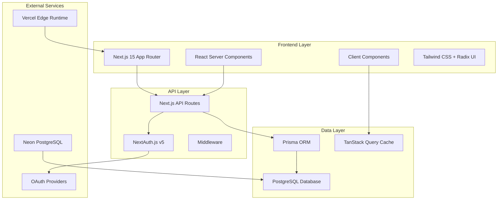
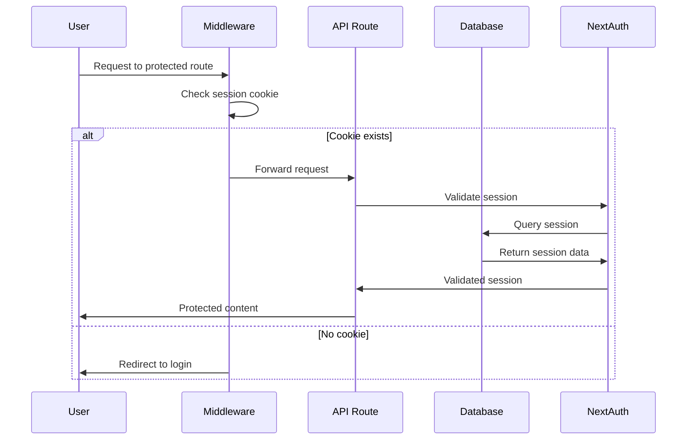
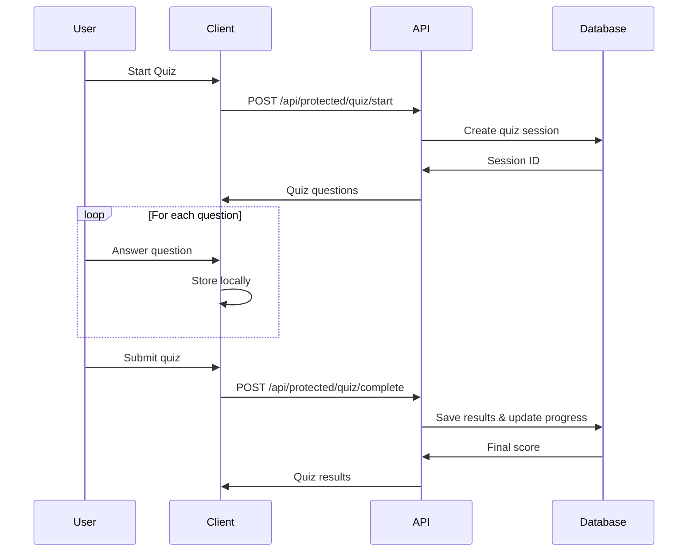
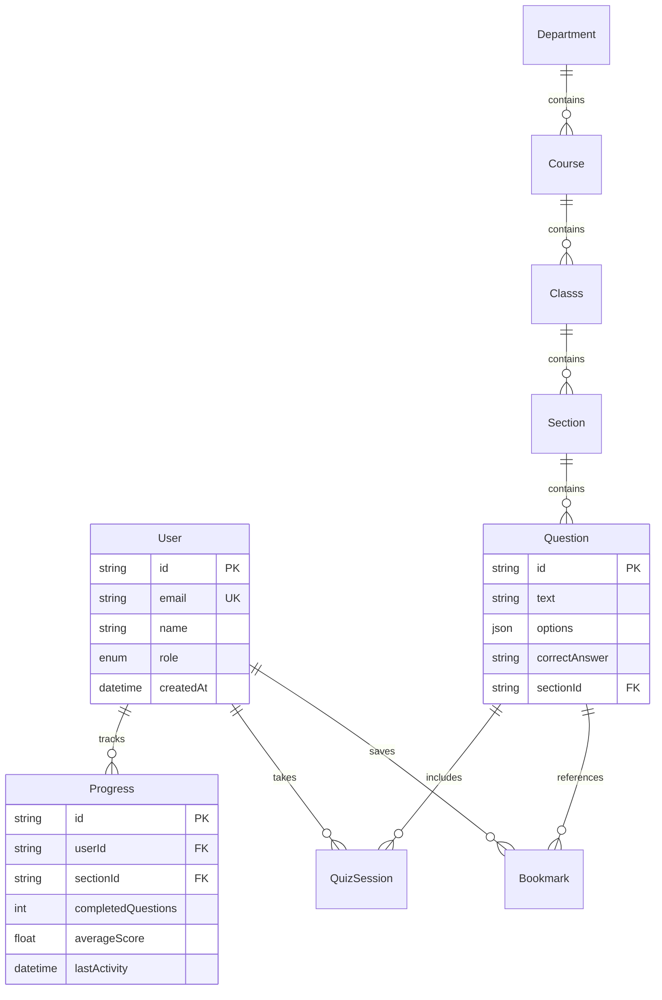

# Architecture Documentation - TriviaMore

[← Back to README](../README.md) | [📚 All Documentation](./README.md)

## Overview

TriviaMore is built with a modern, scalable architecture that prioritizes performance, type safety, and developer experience. The application follows a full-stack approach with Next.js, leveraging both server and client capabilities.

## 🏗️ System Architecture



## 🔄 Data Flow

### Authentication Flow



### Quiz Flow



## 📁 Project Structure

```
src/
├── app/                    # Next.js App Router
│   ├── api/               # API routes
│   │   ├── auth/          # Authentication endpoints
│   │   ├── protected/     # Authenticated routes
│   │   └── guest/         # Anonymous routes
│   ├── (pages)/           # Page components
│   └── globals.css        # Global styles
├── components/            # React components
│   ├── ui/               # Base UI components (Radix)
│   ├── forms/            # Form components
│   └── pages/            # Page-specific components
├── hooks/                # Custom React hooks
├── lib/                  # Utility libraries
│   ├── auth.ts           # NextAuth configuration
│   ├── prisma.ts         # Database client
│   └── utils.ts          # Helper functions
├── providers/            # React context providers
├── types/               # TypeScript type definitions
└── middleware.ts        # Next.js middleware
```

## 🔐 Authentication Architecture

### Hybrid Authentication Approach

TriviaMore uses a two-layer authentication system optimized for Vercel Edge runtime:

#### Layer 1: Edge Middleware

- **Purpose**: Fast routing decisions
- **Technology**: Cookie presence validation
- **Runtime**: Vercel Edge (fast, limited)
- **Scope**: Redirects unauthenticated users

```typescript
// Lightweight edge-compatible check
const sessionCookie = request.cookies.get("authjs.session-token");
if (!sessionCookie && isProtectedRoute) {
    return redirect("/auth/login");
}
```

#### Layer 2: Route-Level Validation

- **Purpose**: Full session validation
- **Technology**: NextAuth.js with database lookup
- **Runtime**: Node.js (full capabilities)
- **Scope**: Validates session integrity and permissions

```typescript
export const GET = auth(async function (request: NextAuthRequest) {
	if (!request.auth) {
		return unauthorized();
	}
	// Full database access available
});
```

### Session Management

- **Strategy**: Database-backed sessions (not JWT)
- **Storage**: PostgreSQL via Prisma
- **Providers**: Google, GitHub, Credentials
- **Security**: Secure cookies, CSRF protection

## 🗄️ Database Design

### Core Entities



### Data Relationships

- **Hierarchical Content**: Department → Course → Class → Section → Questions
- **User Progress**: Tracked per section with detailed analytics
- **Access Control**: Role-based permissions (USER, ADMIN, SUPERADMIN)
- **Bookmarks**: Many-to-many relationship between users and questions

## ⚡ Performance Optimizations

### Frontend

- **React Server Components**: Reduced JavaScript bundle
- **Streaming**: Progressive page loading
- **Image Optimization**: Next.js automatic optimization
- **Code Splitting**: Route-based chunking

### Backend

- **Edge Functions**: Fast global distribution
- **Database Connection Pooling**: Prisma connection management
- **Query Optimization**: Selective field loading
- **Caching**: TanStack Query for client-side caching

### Database

- **Indexing**: Strategic indexes on frequently queried fields
- **Connection Pooling**: Neon's built-in pooling
- **Query Optimization**: Prisma's query optimization
- **Read Replicas**: Future consideration for scaling

## 🚀 Deployment Architecture

### Vercel Platform

- **Edge Functions**: Middleware and routing
- **Serverless Functions**: API routes
- **Static Generation**: Public pages
- **CDN**: Global content delivery

### Database

- **Neon PostgreSQL**: Managed database service
- **Automatic Backups**: Point-in-time recovery
- **Connection Pooling**: Built-in optimization
- **Global Distribution**: Edge database access

## 🔄 State Management

### Client State

- **React State**: Local component state
- **Context API**: Theme, user preferences
- **TanStack Query**: Server state caching

### Server State

- **Database**: Persistent application data
- **Sessions**: User authentication state
- **Cache**: Redis consideration for future scaling

## 🛡️ Security Considerations

### Authentication

- **Session-based**: Database-backed sessions
- **CSRF Protection**: Built-in NextAuth protection
- **Secure Cookies**: HttpOnly, Secure, SameSite

### API Security

- **Route Protection**: Middleware + route-level checks
- **Input Validation**: Zod schemas
- **Rate Limiting**: Future implementation planned

### Data Protection

- **Environment Variables**: Sensitive data protection
- **SQL Injection Prevention**: Prisma ORM protection
- **XSS Prevention**: React's built-in protection

## 📈 Scalability Considerations

### Current Scale

- **Users**: Designed for university-level usage
- **Content**: Hierarchical course structure
- **Performance**: Edge-optimized for global access

### Future Scaling

- **Database Sharding**: Potential for multi-region
- **Microservices**: API modularization
- **Caching Layer**: Redis for high-traffic scenarios
- **CDN Optimization**: Static asset distribution

---

## Related Documentation

- [API Documentation](./API_DOCUMENTATION.md) - Complete API reference
- [Authentication Guide](./AUTH.md) - Detailed auth implementation

[← Back to README](../README.md) | [📚 All Documentation](./README.md)
